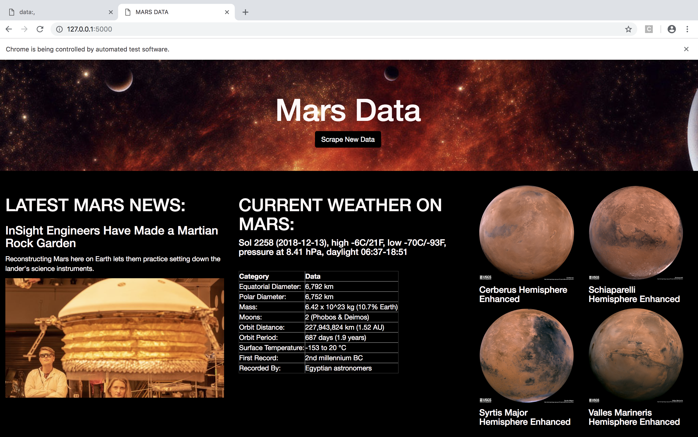

# mission_to_mars

## Introduction

Congratulations! You just won a ticket to Mars! 
Your mission beggins today, but first, let's find out what to expect?!.


## Methodology
[mission_to_mars.ipynb]() Jupyter notebook was used for extracting data from various websites:
1. [NASA Science](https://mars.nasa.gov/news/)
2. [NASA Jet Propulsion Laboratory](https://www.jpl.nasa.gov/spaceimages/?search=&category=Mars)
3. [Mars Weather Twitter](https://twitter.com/marswxreport?lang=en)
4. [Space Facts](http://space-facts.com/mars/)
5. [Astrogeology Science Center](https://astrogeology.usgs.gov/search/results?q=hemisphere+enhanced&k1=target&v1=Mars)

Jupyter notebook [mission_to_mars.ipynb](https://github.com/janelcv/mission_to_mars/blob/master/mission_to_mars.ipynb) was converted into __scrape()__  function and stored as python file [scrape_mars.py]().

In addition, __Flask__  environment with two routes was created:
1.  `/scrape`  which imports  `scrape_mars.py` script and calls  `scrape` function.
2. `/` which query  Mongo database and pass the mars data into an HTML template to display the data.


### Extraction

Data was extracted using Python (version 3.6) [Pandas](https://pandas.pydata.org/pandas-docs/stable/) module  in [mission_to_mars.ipynb](https://github.com/janelcv/mission_to_mars/blob/master/mission_to_mars.ipynb)  Jupyter Notebook and stored as function in [scrape_mars.py](https://github.com/janelcv/mission_to_mars/blob/master/scrape_mars.py).

>This Jupyter Notebook  was used to test every step of the code prior developing the web application. Code for scraping the website is located in [scrape_mars.py](https://github.com/janelcv/mission_to_mars/blob/master/scrape_mars.py).

```python
# Dependencies
from bs4 import BeautifulSoup
from splinter import Browser
browser = Browser('chrome')
import requests
import pandas as pd
import numpy as np
import re
import json
```

[BeautifulSoup](https://en.wikipedia.org/wiki/Beautiful_Soup_(HTML_parser)) was used to scrape information from various websites. This step was recreated for each website using different urls.

```python

#url of page to be scraped
url = '<target url>'

#Retrieve page
response = browser.visit(url)

#Create BeautifulSoup object and parse the html page
soup = BeautifulSoup(response.text, 'html.parser')
```
Scraping part was devided into five parts, corresponded to each webpage: 

1. [NASA Science](https://mars.nasa.gov/news/). NASA Mars News.
```python
# NASA Mars News titles
url = 'https://mars.nasa.gov/news/?page=0&per_page=40&order=publish_date+desc%2Ccreated_at+desc&search=&category=19%2C165%2C184%2C204&blank_scope=Latest'
response = browser.visit(url)
soup = BeautifulSoup(browser.html, 'html.parser')
article_title= soup.find("div", class_='content_title').text.strip()

# NASA Mars News text
url = 'https://mars.nasa.gov/news/page=0&per_page=40&order=publish_date+desc%2Ccreated_at+desc&search=&category=19%2C165%2C184%2C204&blank_scope=Latest'
response = browser.visit(url)
soup = BeautifulSoup(browser.html, 'html.parser')
article_p = soup.find("div", class_='rollover_description_inner').text.strip()

```
2. [NASA Jet Propulsion Laboratory](https://www.jpl.nasa.gov/spaceimages/?search=&category=Mars). JPL Mars Space Images - Featured Image.
```python

url = 'https://www.jpl.nasa.gov/spaceimages/?search=&category=Mars'
response = browser.visit(url)
soup = BeautifulSoup(browser.html, 'html.parser')
image = soup.find('img', class_='thumb').get('src')
featured_image_url = 'https://www.jpl.nasa.gov' + image

```

3. [Mars Weather Twitter](https://twitter.com/marswxreport?lang=en). Mars Weather 
```python

url = 'https://twitter.com/marswxreport?lang=en'
response = browser.visit(url)
soup = BeautifulSoup(browser.html, 'html.parser')
tweets = soup.find('li', class_='js-stream-item')
weather = ''
for tweet in tweets:
if 'Sol' not in weather:
weather = tweets.find('div', class_='js-tweet-text-container')
mars_weather = weather.p.text
```
To grab the specific tweet from Twitter webpage specific condition was included into  the code.

```python
for tweet in tweets:
if 'Sol' not in weather:
weather = tweets.find('div', class_='js-tweet-text-container')
```

4. [Space Facts](http://space-facts.com/mars/). Mars Facts.
Function `pd.read_html()`  was used to extract the HTML table from the Webpage and convert it  into a list of dataframe objects. Furhter data was converted into a new HTML table.

```python

mars_df = pd.read_html('http://space-facts.com/mars/',attrs={'id':'tablepress-mars'})
mars_df = mars_df[0]
mars_df.columns = ["Category", "Data"]
mars_df_html = mars_df.to_html(index = False)
```

5. [Astrogeology Science Center](https://astrogeology.usgs.gov/search/results?q=hemisphere+enhanced&k1=target&v1=Mars). Mars Hemispheres.

```python

url = 'https://astrogeology.usgs.gov/search/results?q=hemisphere+enhanced&k1=target&v1=Mars'
title=[]
response = browser.visit(url)
soup = BeautifulSoup(browser.html, 'html.parser')
titles_list = soup.find_all('div', class_='description')
for titles in titles_list:
t = titles.h3.text
title.append(t)
```

`urls_list` was created to store url for each image, beacause images for Mars Hemishepers were stored on different web pages. The image link from each url was scraped using `for loop`  and completed with funciton `re.compile('^http://')` . 
```python

urls_list=['https://astrogeology.usgs.gov/search/map/Mars/Viking/cerberus_enhanced',
'https://astrogeology.usgs.gov/search/map/Mars/Viking/schiaparelli_enhanced',
'https://astrogeology.usgs.gov/search/map/Mars/Viking/syrtis_major_enhanced',
'https://astrogeology.usgs.gov/search/map/Mars/Viking/valles_marineris_enhanced']
image_url=[]
for urls in urls_list:
url = urls
response = browser.visit(url)
soup = BeautifulSoup(browser.html, 'html.parser')
image = soup.find('a', attrs={'target':'_blank', 'href': re.compile('^http://')})
image_link = image.get('href')
image_url.append(image_link)
```

Function `dict()`  was used to create a dictionary with keys and values for each MARS Hemisphere. Further they were stored inside the list of dictionaries `hemisphere_image_urls`. 

```python
hemisphere_image_urls=[]
for i in range(len(title)):
d = dict([('title', title[i]), ('img_url', image_url[i])])
hemisphere_image_urls.append(d)
```

Final step was  to add the final outputs of each web scrape to the dictionary `mars_data`. This step was done after each final output was obtained.

```python
mars_data = {
'latest_title': article_title,
'latest_paragraph': article_p,
'image_url': featured_image_url,
'weather': mars_weather,x
'data_table': mars_df_html,
'hemispheres': hemisphere_image_urls
}
```
### HTML file 

A templates folder was created to store the index.html file. Bootstap library was used In building [index.html](https://github.com/janelcv/mission_to_mars/blob/master/templates/index.html). Template folder would allow app.py to extract from the MongoDB database directly and load onto the webpage.

A button on the `<div class="jumbotron text-center">`  was created to act like a link to app.py. Each time this button is clicked, the most updated information about Mars was placed in index.html.


### MongoDB and FLASK
The data stored in mars_data was loaded into MongoDB using the Flask app [app.py](https://github.com/janelcv/mission_to_mars/blob/master/app.py).

```python
from flask import Flask, render_template, redirect
from datetime import datetime
import scrape_mars
import pymongo
import json
```
```python
conn = "mongodb://localhost:27017"
client = pymongo.MongoClient(conn)
```
Using the flask two app routes were created:

1. The first route called the `scrape()` function from `scrape_mars.py` , stored scraped information into MongoDB datebase and redirected to the `"/"`.

```python
app = Flask(__name__)

@app.route("/scrape")
def scrape_data():
scraped_data = scrape_mars.scrape()
mars_db = client.mars
data = mars_db.mars_data
data.delete_many({})
data.insert(scraped_data)
return redirect("/", code=302)

if __name__ == "__main__":
app.run(debug = True)
```
1. The second route used function called index that extracted information from the database. 
```python
@app.route("/")
def index():
mars_db = client.mars
data = mars_db.mars_data.find_one()
print(data)
return render_template("index.html", data = data, current_time=datetime.utcnow())


if __name__ == "__main__":
app.run(debug=True)
```

### Final Output

Before running app.py:
>Use separate command line

1. MongoDB was initialised in the command line.
```html
$ mongod
```
2. Python Environment was initialised in the command line

```html
$ source activate pythondata
```
As an output  `app.py` was run in Python Environment using command:

```html
$ Flask run
```
Google Chrome window will be automatically oppened after. In the second tab opening the route http://127.0.0.1:5000/ will automatically load index.html on the browser. Clicking the Scrape New Data button would rerun app.py and show the latest data.



